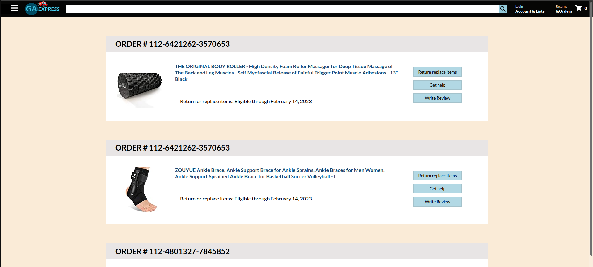

# GA Express - Front-End Shop

The GA Express site is an e-commerce site which promotes the sales of the best products available on the market.  This project is tied to a back-end also built by our group and includes many features as detailed below.

## Screen Shots

### Home Page

### Categories

### Sign-In

### Cart

### Orders

## Pages

To navigate to an individual page via the URL, use the following:
1) Home:  http://localhost:3000/
2) Categories: http://localhost:3000/categories
3) Sign-In: http://localhost:3000/sign-in
4) Sign-Out: http://localhost:3000/sign-out
5) Cart: http://localhost:3000/checkout
6) Orders: http://localhost:3000/order

## Technical Notes

### Data

The API provided several fields of data but the only fields used for this project are:
1) Title (Name of the Product)
2) Description 
3) Price 
4) Brand
5) Category (Shoes, Technology, etc.)
6) Images (URL)

### Dependencies
- axios
- node-fetch
- react 
- react-dom
- react-icons
- react-js-switch
- react-router-dom
- react-scripts

## Overview of Process

### Stage 0 - Planning (All)
Established what we would pursue, developed a wireframe, outlined component swap on the front-end, determined what we needed at a minimum to be released for the back-end to begin testing, set timelines for when we hoped to achieve each state.

### Stage 1 - Initial Set-Up
Backend (Muhammad, Angela, Ryan)
- Constructed Skeleton for folders and file structure
- Created JSON with raw data

Front-End (Anna, Bryant)
- Constructed skeleton for folders and file structure
- Created JSON with data to use while Backend was being constructed

*Goal:  Working on these items allowed us to get to a point where we could divide work and pair program*

### Stage 2 - Get Backend Running, Front-end Development
Backend (Muhammad, Angela, Ryan)
- Completed Products CRUD and shell for Users
Tested & moved to main branch for use on Front-End

Front-End (Anna, Bryant)
- Connected Links and Navigation and prepared to connect with back-end

*Goal:  We wanted to ensure the back end was working in order to test data on the front end.*

### Stage 3 - Connect Front and Back End, Continue to build out Front-End
Backend (Anna, Bryant, Ryan)
- Included code for User-Authentication

Front-End (Muhammad, Angela, Ryan)
- Connected Back-End to Front-End
- Added features/components for including all products, navigate by products, cart count for items

*Goal:  We worked to ensure the site was in working order with the basic features we wanted to achieve.*  

### Stage 4 - Enhance Backend Data and Finalize Front End
Backend (Muhammad, Angela)
- Updated JSON to include additional items

Front-End (All)
- Added additional features for login/logout, search navigation, cart counter and item deletion
- Added Logo!
- Merged and tested on all machines that we were all able to access 
- Ensured README was updated and code was commented

*Goal:  Finalized project and prepared for presenting*

## API Data

### API Endpoints

- Home:  http://localhost:4000/products

### Snippet of object output:

## Wire Frame 

# Team 

## **Anna Druzhinina**
LinkedIn: https://www.linkedin.com/in/anna-druzhinina/

GitHub: https://github.com/annadruzhinina

## **Angela Kwon**
LinkedIn: https://www.linkedin.com/in/angelakwon2/

GitHub: https://github.com/kwonangela

## **Bryant Perez**

LinkedIn: https://www.linkedin.com/in/bryxntperez

GitHub: https://github.com/bryxnt1

## **Muhammad Warrad** 
LinkedIn: https://www.linkedin.com/in/muhammadwarrad/

GitHub: https://github.com/muhammadwarrad

## **Ryan Ehrlich**
LinkedIn: https://www.linkedin.com/in/ryanehrlich/

GitHub: https://github.com/Jagerziel

